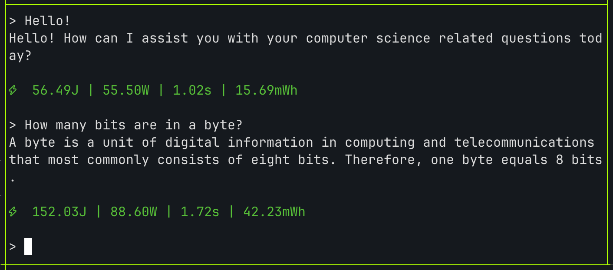
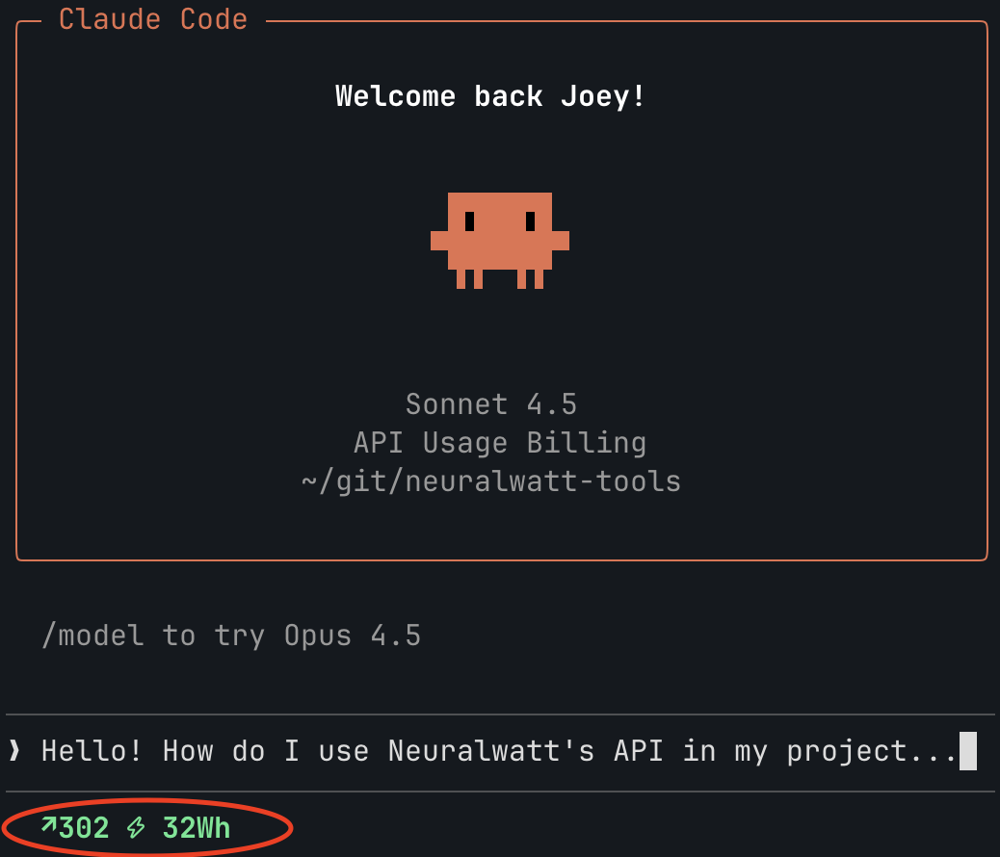

# neuralwatt-tools

[](https://github.com/neuralwatt/neuralwatt-tools/actions/workflows/ci.yml)
[](https://www.python.org/downloads/)
[](LICENSE)

Tools and recipes for using the [Neuralwatt](https://neuralwatt.com) inference API.





## What is Neuralwatt?

[Neuralwatt](https://neuralwatt.com) builds software for energy-efficient AI infrastructure. As part of this, we run a hosted inference API at [portal.neuralwatt.com](https://portal.neuralwatt.com).

**OpenAI-compatible API.** Neuralwatt exposes an OpenAI-compatible endpoint (`https://api.neuralwatt.com/v1`), so it works with any tool that supports custom base URLs: coding assistants like [aider](https://aider.chat) and [continue.dev](https://continue.dev), CLI tools like [llm](https://llm.datasette.io), and many editor plugins.

**Energy reporting.** Neuralwatt returns energy consumption data with every API response, alongside the standard token counts:

```json
{
  "usage": {
    "prompt_tokens": 10,
    "completion_tokens": 3,
    "total_tokens": 13
  },
  "energy": {
    "energy_joules": 60.37,
    "energy_kwh": 0.00001677,
    "avg_power_watts": 3755.0,
    "duration_seconds": 0.083
  }
}
```

## Quick Start

Get your API key from [portal.neuralwatt.com](https://portal.neuralwatt.com), then pick an integration:

| Integration | What It Does | Get Started |
|-------------|--------------|-------------|
| [nw-usage](scripts/) | CLI for checking energy usage | `nw-usage` or `nw-usage --tmux` |
| [Claude Code](recipes/claude-code/) | Anthropic's coding CLI with Neuralwatt models | [Setup guide](recipes/claude-code/README.md) |
| [OpenCode](recipes/opencode/) | AI coding agent CLI | [Setup guide](recipes/opencode/README.md) |
| [llm plugin](plugins/llm-neuralwatt/) | Use Neuralwatt with [simonw/llm](https://llm.datasette.io/) CLI | [Setup guide](plugins/llm-neuralwatt/README.md) |
| [Neovim](recipes/neovim/) | AI completions + energy monitor | [Setup guide](recipes/neovim/README.md) |
| [Tmux](recipes/tmux/) | Show usage in status bar | [Setup guide](recipes/tmux/README.md) |

## What's Inside

```
neuralwatt-tools/
├── scripts/
│   └── nw-usage             # CLI for checking energy usage
├── plugins/
│   └── llm-neuralwatt/      # pip-installable LLM plugin
└── recipes/
    ├── claude-code/         # Anthropic's coding CLI setup
    ├── opencode/            # AI coding agent CLI setup
    ├── neovim/              # Energy monitor + AI plugin configs
    └── tmux/                # Statusline integration
```

## Using with Any OpenAI-Compatible Tool

Most AI tools support custom endpoints. Point them at Neuralwatt:

```python
from openai import OpenAI

client = OpenAI(
    base_url="https://api.neuralwatt.com/v1",
    api_key="your-api-key-here"
)
```

Or via environment variables:

```bash
export OPENAI_API_BASE="https://api.neuralwatt.com/v1"
export OPENAI_API_KEY="your-api-key"
```

## Links

- [portal.neuralwatt.com](https://portal.neuralwatt.com): Hosted inference API (get your API key here)
- [neuralwatt.com](https://neuralwatt.com): Core product, energy efficiency software for AI infrastructure

## Contributing

Have a recipe for another tool? PRs welcome!

## License

Apache-2.0
