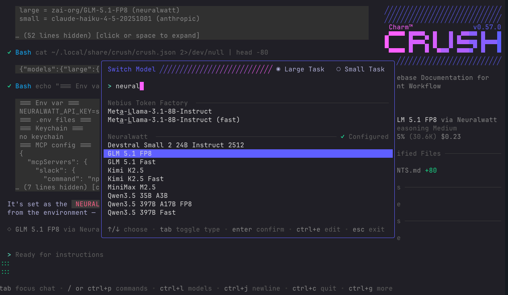

# Crush with Neuralwatt

[Crush](https://crush.land) is an AI coding agent CLI that discovers providers from environment variables automatically. If `NEURALWATT_API_KEY` is set, Neuralwatt models appear with no configuration.



## Prerequisites

- [Neuralwatt API key](https://portal.neuralwatt.com)

## Install

```bash
# Homebrew (macOS/Linux)
brew install charm-sh/tap/crush

# Or download directly from https://crush.land
```

## Setup

**Export your API key** (add to `~/.zshrc`):

```bash
export NEURALWATT_API_KEY="your-api-key-here"
```

That's it. Crush detects the key and registers Neuralwatt as a provider automatically.

## Run

```bash
crush
```

## Switch Models

1. Press `/` to open the command menu
2. Select **Switch Models**
3. Filter by "Neuralwatt"
4. Pick a model

You can also set a default model in `~/.local/share/crush/crush.json`:

```json
{
  "model": {
    "large": "Qwen/Qwen3.5-397B-A17B-FP8"
  }
}
```

## Available Models

Browse the full catalog at [portal.neuralwatt.com](https://portal.neuralwatt.com), or query the API directly:

```bash
curl -s -H "Authorization: Bearer $NEURALWATT_API_KEY" \
  https://api.neuralwatt.com/v1/models | jq '.data[].id'
```
