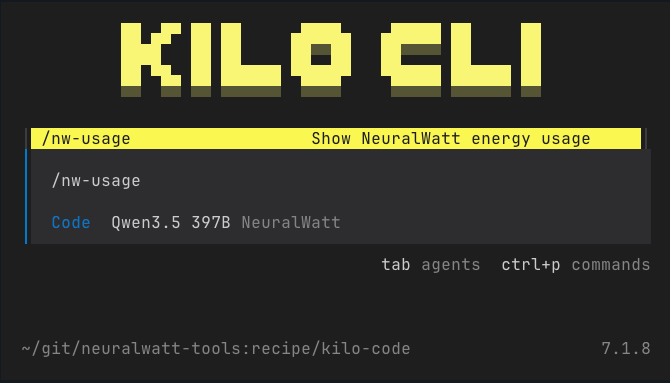

# Kilo Code CLI with Neuralwatt

[Kilo Code](https://kilo.ai) ([GitHub](https://github.com/Kilo-Org/kilocode)) is an AI coding agent CLI and a fork of [OpenCode](https://opencode.ai). It inherits OpenCode's [models.dev](https://models.dev) catalog, so Neuralwatt is a built-in provider. Set your API key and you're done.



## Install

See [Kilo Code installation docs](https://kilo.ai/docs/getting-started/installation) for all options, or:

```bash
# npm (all platforms)
npm install -g @kilocode/cli

# or run without installing
npx @kilocode/cli

# Homebrew (macOS/Linux)
brew install Kilo-Org/tap/kilo
```

## Setup

Export your API key (add to `~/.zshrc` or `~/.bashrc`):

```bash
export NEURALWATT_API_KEY="your-api-key-here"
```

Launch Kilo:

```bash
kilo
```

Open the model picker (`Ctrl+M`), filter by "Neuralwatt", and pick a model.

## Set a Default Model

Optional. Add to `~/.config/kilo/kilo.json` (global) or `./kilo.json` (per-project):

```json
{
  "model": "neuralwatt/zai-org/GLM-5-FP8"
}
```

## Energy Usage Command

Add a `/nw-usage` command to check your energy consumption from within Kilo.

**1. Install the script** (see [scripts/README.md](../../scripts/)):

```bash
ln -s /path/to/neuralwatt-tools/scripts/nw-usage ~/.local/bin/nw-usage
```

**2. Add the command** to your `~/.config/kilo/kilo.json`:

```json
{
  "command": {
    "nw-usage": {
      "description": "Show Neuralwatt energy usage",
      "template": "Here is my Neuralwatt API usage:\n\n!`nw-usage`\n\nReport this to the user."
    }
  }
}
```

**3. Use it** by typing `/nw-usage` in Kilo.
