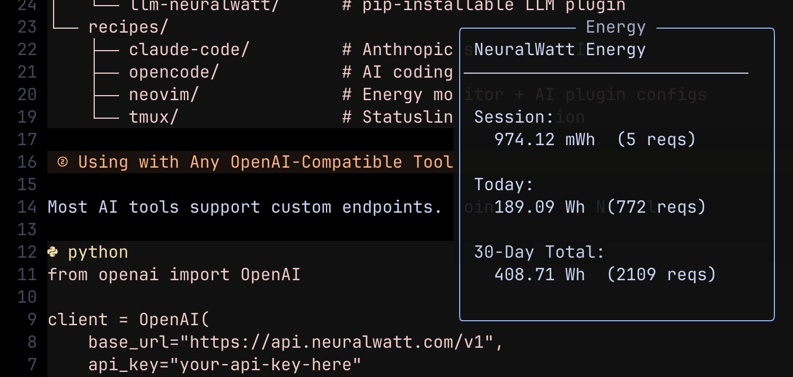

# Neovim with Neuralwatt

Two ways to use Neuralwatt in Neovim:

1. **Energy Monitor** - Track your Neuralwatt API usage in a floating window
2. **AI Completions** - Use Neuralwatt as the backend for coding assistant plugins

## Energy Monitor

A Lua module that polls the Neuralwatt usage API and displays energy stats.



### Installation

Copy `energy-monitor.lua` to your Neovim config:

```bash
mkdir -p ~/.config/nvim/lua/neuralwatt
cp energy-monitor.lua ~/.config/nvim/lua/neuralwatt/init.lua
```

### Setup

Add to your Neovim config (e.g., `init.lua`):

```lua
require("neuralwatt").setup({
  api_key_file = vim.fn.expand("~/.config/neuralwatt/api_key"),
  poll_interval_ms = 30000,  -- 30 seconds
  auto_start = true,
})
```

Create the API key file:

```bash
mkdir -p ~/.config/neuralwatt
echo "your-api-key-here" > ~/.config/neuralwatt/api_key
```

### Commands

| Command | Description |
|---------|-------------|
| `:NeuralwattEnergy` | Show full stats in a floating window |
| `:NeuralwattMini` | Toggle mini stats in corner |
| `:NeuralwattNotify` | Show stats as notification |

### Key Bindings (Optional)

```lua
vim.keymap.set('n', '<leader>ne', ':NeuralwattEnergy<CR>', { desc = 'Neuralwatt energy stats' })
vim.keymap.set('n', '<leader>nm', ':NeuralwattMini<CR>', { desc = 'Neuralwatt mini toggle' })
```

---

## AI Completions

Neuralwatt is OpenAI-compatible, so any Neovim plugin that supports OpenAI can use it.

### codecompanion.nvim

```lua
require("codecompanion").setup({
  adapters = {
    neuralwatt = function()
      return require("codecompanion.adapters").extend("openai", {
        url = "https://api.neuralwatt.com/v1/chat/completions",
        env = { api_key = "NEURALWATT_API_KEY" },
        schema = {
          model = { default = "Qwen/Qwen3-Coder-480B-A35B-Instruct" },
        },
      })
    end,
  },
  strategies = {
    chat = { adapter = "neuralwatt" },
    inline = { adapter = "neuralwatt" },
  },
})
```

### avante.nvim

```lua
require("avante").setup({
  provider = "openai",
  openai = {
    endpoint = "https://api.neuralwatt.com/v1",
    model = "Qwen/Qwen3-Coder-480B-A35B-Instruct",
    api_key_name = "NEURALWATT_API_KEY",
  },
})
```

### gen.nvim

```lua
require("gen").setup({
  model = "Qwen/Qwen3-Coder-480B-A35B-Instruct",
  host = "api.neuralwatt.com",
  port = 443,
  command = function(options)
    return "curl -sN https://api.neuralwatt.com/v1/chat/completions "
      .. "-H 'Authorization: Bearer " .. os.getenv("NEURALWATT_API_KEY") .. "' "
      .. "-H 'Content-Type: application/json' "
      .. "-d '{\"model\": \"" .. options.model .. "\", \"messages\": [{\"role\": \"user\", \"content\": \"$prompt\"}], \"stream\": true}'"
  end,
})
```

### Environment Variable

For all plugins, set your API key:

```bash
export NEURALWATT_API_KEY="your-api-key-here"
```

Add to your shell profile (`.zshrc`, `.bashrc`, etc.) to persist.
