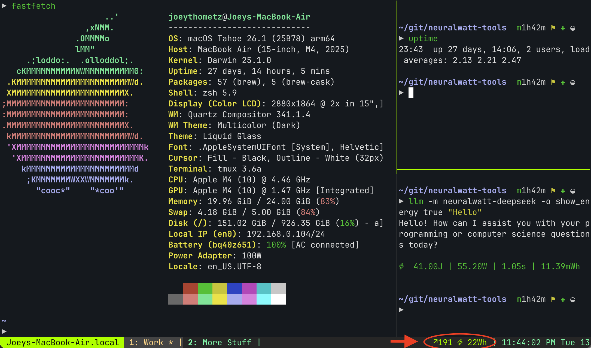

# Tmux Statusline with NeuralWatt

Show your NeuralWatt API usage in the tmux status bar.



## Setup

1. Copy the script:

```bash
cp scripts/nw-usage ~/.local/bin/
chmod +x ~/.local/bin/nw-usage
```

2. Set your API key (add to `~/.zshrc`):

```bash
export NEURALWATT_API_KEY="your-api-key-here"
```

3. Add to `~/.tmux.conf`:

```bash
set -g status-right '#[fg=colour154] #(~/.local/bin/nw-usage --tmux) #[fg=colour121]| %H:%M'
```

4. Reload tmux:

```bash
tmux source-file ~/.tmux.conf
```

## How It Works

The script calls `/v1/usage/energy` and caches results for 5 minutes. See `scripts/nw-usage --help` for all options.
